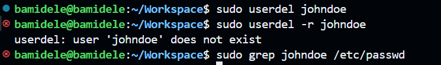

# Advanced Linux Commands

## File Permissions and Access Rights

### chmod command

The `chmod` command allows you to modify file permissions. You can use
both symbolic and numeric representations to assign permissions to the
user, group, and others.

#### How it works

- Create an empty file:

- Check the file permissions:

- Update the file permissions using `chmod`:

- Using the numeric representation:

### chown command

The `chown` command allows you to change the ownership of files,
directories, or symbolic links to a specified username or group.

#### How chown works

- Create a user:

- Grant the user sudo privileges:

- Switch to the new user:

- Modify user account, by changing user's password:

- Switch between users:

- Create a group:

- Verify the group:

- Add the user to the group:

- Verify the user is added to the group:

- Delete the user:

- Change group ownership of a directory:

- Change group permissions of a directory:

## Side Task

- Create a group on the server and name it `devops`

- Create 5 users `["mary", "mohammed", "ravi","tunji", "sofia" ]`, and ensure each user belong to the devops group

- Create a folder for each user in the `/home` directory. For example `/home/mary`.

- Ensure that the group ownership of each created folder belongs to "devops"

- Verify the group ownership of each created folder belongs to "devops"

