# Basic Linux Commands

This repository contains a collection of basic Linux commands that are commonly used in the command line interface (CLI). These commands are essential for navigating and managing files and directories in a Linux environment.

## Sudo Command

In Linux, some actions need special permission to be carried out, like creating files in certain areas or changing important system settings. This is where the `sudo` command comes into play. "`sudo`" stands for "superuser do", and it allows you to 'temporarily' run commands with the security privileges of another user, typically the superuser or "root.".

### How `sudo` works

- When you create a directory in a restrited area, you will get a "permission denied" error.

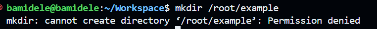

- To create a directory in a restricted area, you can use the `sudo` command followed by the command you want to run.

- To verify that the directory was created, you can use the `ls` command to list the contents of the directory.

## `pwd` Command

The `pwd` command stands for "print working directory". It is used to display the current directory you are in within the command line interface. This is useful for understanding your current location in the file system hierarchy.

### How `pwd` works

- To use the `pwd` command, simply type `pwd` in the terminal and press Enter.

## `cd` Command

The `cd` command stands for "change directory". It is used to navigate between directories in the file system. You can use it to move to a specific directory or go back to the previous one.

### How `cd` works

- To change to a specific directory(root director "`/`", use `sudo`), type `sudo cd` followed by the path of the directory you want to navigate to.

- To list the files and directories in the current directory, you can use the `ls` command.

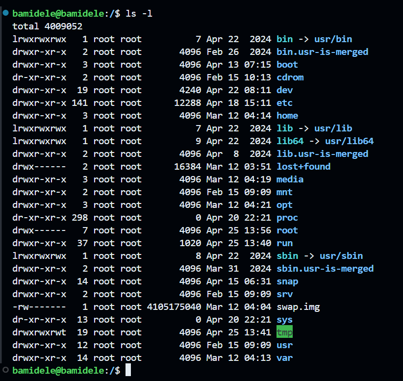

## Side Hustle Task 1

1. Create a directory called `photos` inside the `/usr` directory.

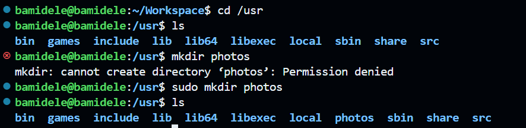

2. Navigate into the ` photos' directory

3. Create 3 more random directories inside the ` photos' directory.

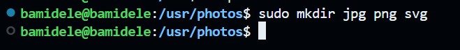

4. Show the newly created directories on the terminal.

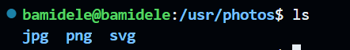

5. Navigate into one of them

6. Show the full path where you currently are on the screen.

## `ls` Command

The `ls` command is used to list the contents of a directory. It displays the files and subdirectories within the current directory or a specified directory. The `ls` command has various options that can be used to customize the output, such as showing hidden files, displaying file sizes, and more.

### How `ls` works

## `cat` Command

'Concatenate', or `cat`, is one of the most frequently used Linux commands. It lists, combines, and writes file content to the standard output (i.e to the terminal console). To run the `cat` command, type `cat` followed by the file name and its extension. For example:

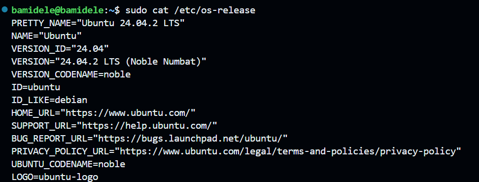

## `cp` Command

Use the `cp`command to copy files or directories and their content from one location to another.

### How `cp` works

- To copy a file, use the `cp` command followed by the source file and the destination directory.

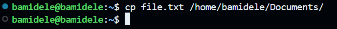

- To copy multiple files into a directory

- To copy content from 'file.txt' to 'file2.txt', use the `cp` command followed by the source file and the destination file.

- To copy a directory and its contents, use the `cp` command with the `-R` option (recursive) followed by the source directory and the destination directory.

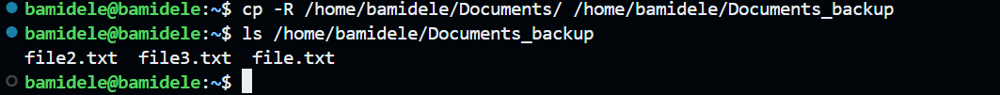

## `mv` Command

The `mv` command is used to move or rename files and directories in Linux. It allows you to change the location of a file or directory or rename it without creating a copy.

### How `mv` works

- To move a file, use the `mv` command followed by the source file and the destination directory.

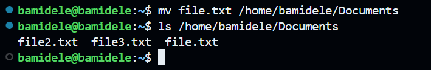

- To rename a file, use the `mv` command followed by the current file name and the new file name.

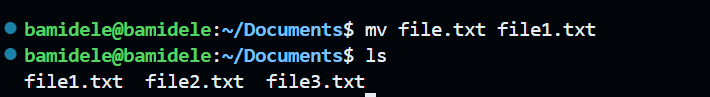

## `rm` Command

The `rm` command is used to remove files and directories in Linux. It allows you to delete files and directories permanently.

### How `rm` works

- To remove a file, use the `rm` command followed by the file name.

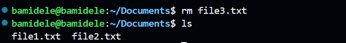

- To remove multiple files, use the `rm` command followed by the file names.

## `touch` Command

The `touch` command is used to create empty files.

### How `touch` works

- To create an empty file, use the `touch` command followed by the file name.

## `find` Command

The `find` command is used to search for files and directories in a specified location. It allows you to search for files based on various criteria, such as name, type, size, and more.

### How `find` works

- To find a file by name, use the `find` command followed by the directory to search in and the `-name` option with the file name.

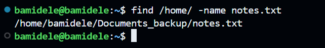
