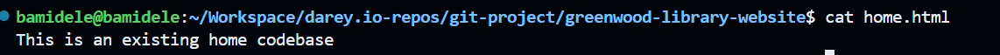
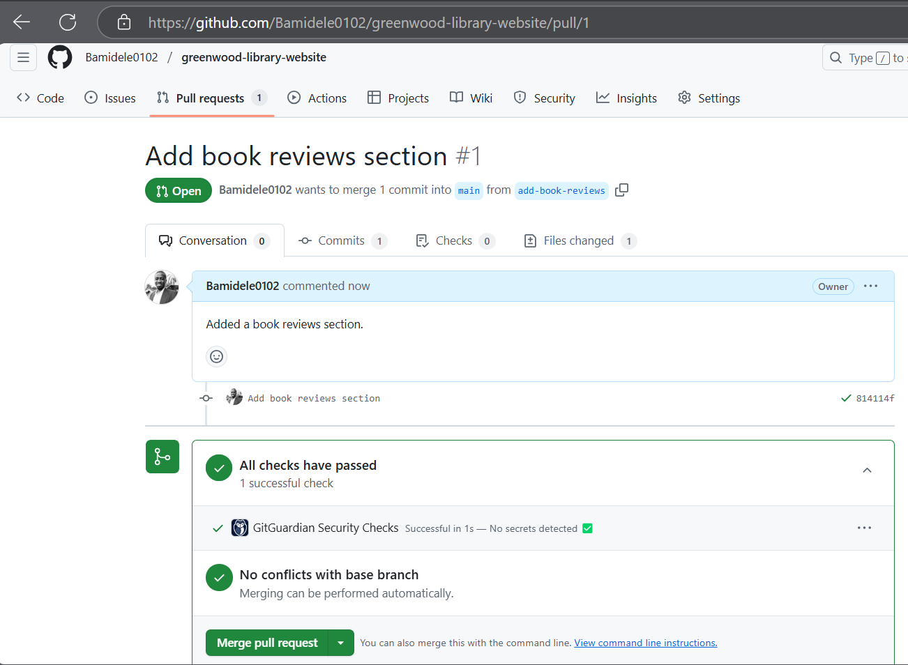

# CAPSTONE PROJECT - Git

This is a project to demonstrate the use of Git and GitHub for version control and collaboration

## Objectives

- Practice cloning a repository and working with branches in Git.

- Gain experience in staging, committing, and pushing changes from
both developers.

- Create pull requests and merge them after resolving any potential
conflicts.

### Setup

- I created a repository on GitHub, intialize it with a README file.

- I cloned it to my local machine.

### Tasks

- I created four new files in the `main` branch and added some content to them.

- I staged the changes and committed them with a descriptive message.

- I pushed changes directly to the `main` branch on Github

### Morgan's Work

- I created a new branch named `add-book-reviews` and switched to it.

- I created a new file named `book-reviews.html`, and added some content into it.

- I staged the changes and committed them with a descriptive message.

- I pushed the changes to the `add-book-reviews` branch on GitHub.

- I created a pull request to merge the changes from the `add-book-reviews` branch into the `main` branch.

- I reviewed the changes and merged the pull request.

### James's Work

- I created a new branch named `update-events` and switched to it.

- I updated the `events.html` file with some new content in the new branch.

- I staged the changes and committed them with a descriptive message.

- I pull the latest changes from the `main` branch to ensure that my branch is up to date.

- I pushed the changes to the `update-events` branch on GitHub.

- I created a pull request to merge the changes from the `update-events` branch into the `main` branch.

- I reviewed the changes and merged the pull request.

