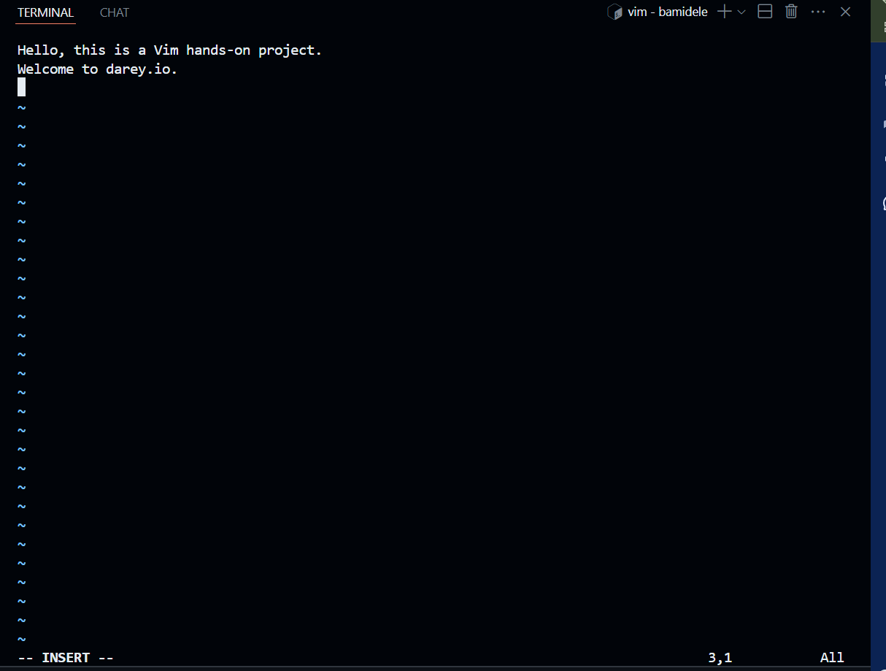
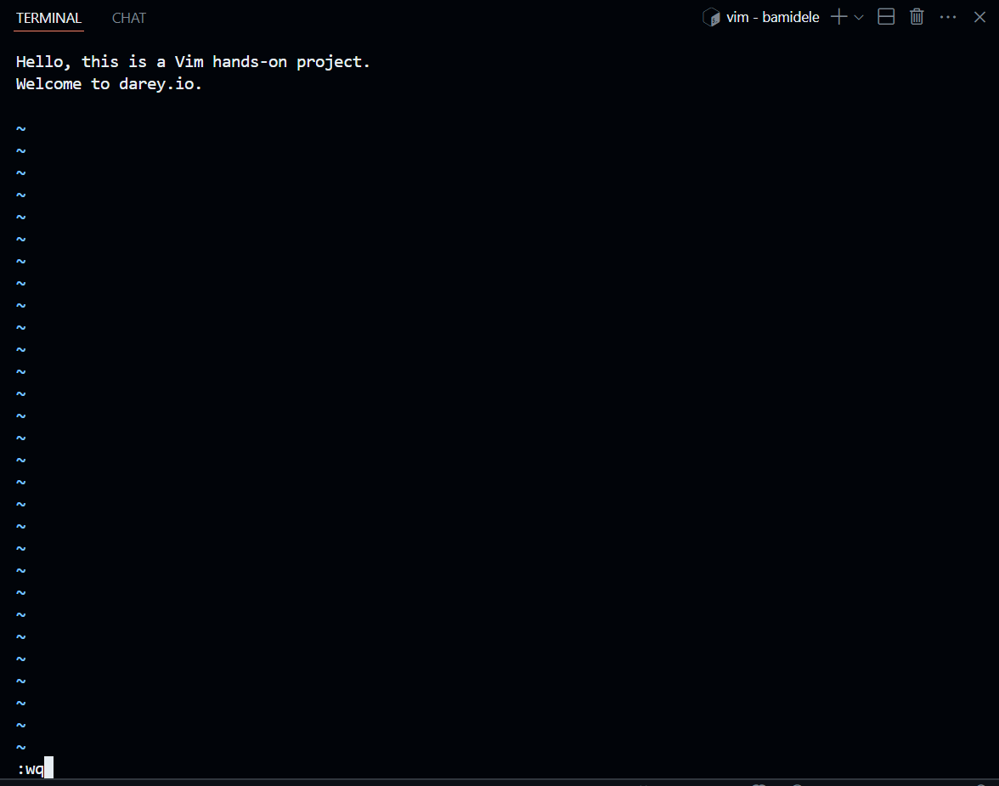
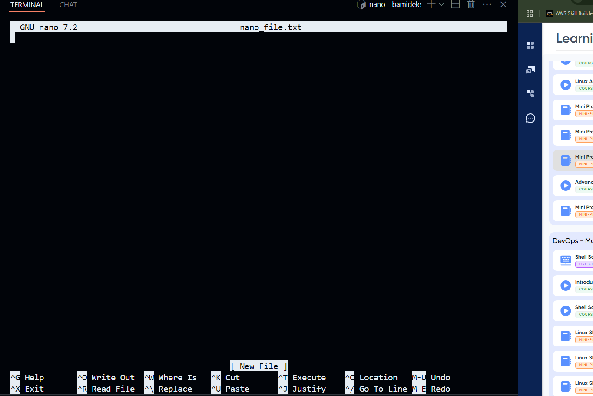
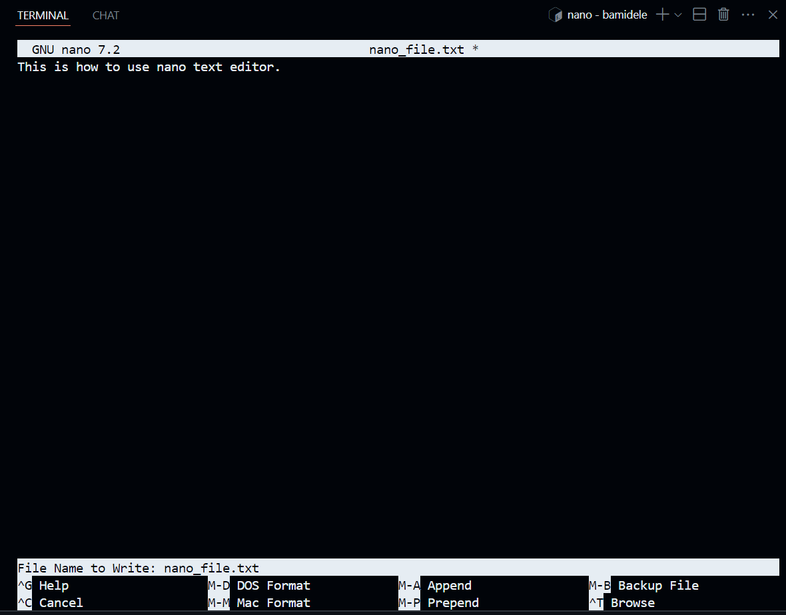
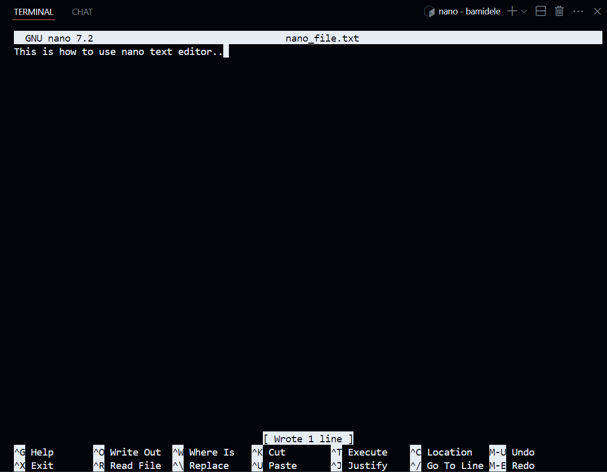

# Linux Text Editors

## Vim Text Editor

Vim is a highly configurable text editor built to enable efficient text editing. It is an improved version of the vi editor distributed with most UNIX systems.

The Linux Vim text editor, short for "Vi Improved," is a powerful and versatile text editing tool deeply ingrained in the Unix and Linux ecosystems. Vim builds upon the foundation of the original Vi editor, offering an extensive set of features, modes, and commands that empower users to manipulate text efficiently. While Vim has a steeper learning curve compared to simpler editors like Nano, its capabilities make it a favourite among tech professionals and anyone working extensively
with text files.

### Installation

To install Vim on your Linux system, you can use the package manager specific to your distribution. Here are the commands for some popular distributions:

  ```bash
  sudo apt update
  sudo apt install vim
  ```

### Working with Vim

- Open a new file named `example.txt` in Vim:



- Save the file and exit Vim:




## Nano Text Editor

Nano is a simple, user-friendly text editor for Unix-like operating systems. It is designed to be easy to use, making it an excellent choice for beginners and those who prefer a straightforward editing experience. Nano provides a terminal-based interface with basic text editing features, allowing users to create and modify files quickly.

### Working with Nano Editor

- Open a new file named `nano_file.txt` in Nano:



- Edit, save the file and exit Nano:






  