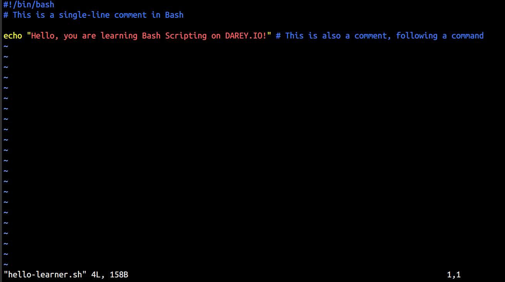
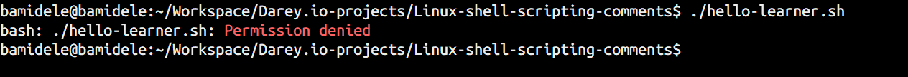
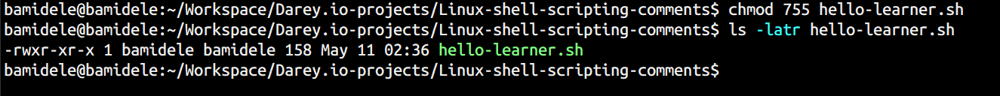
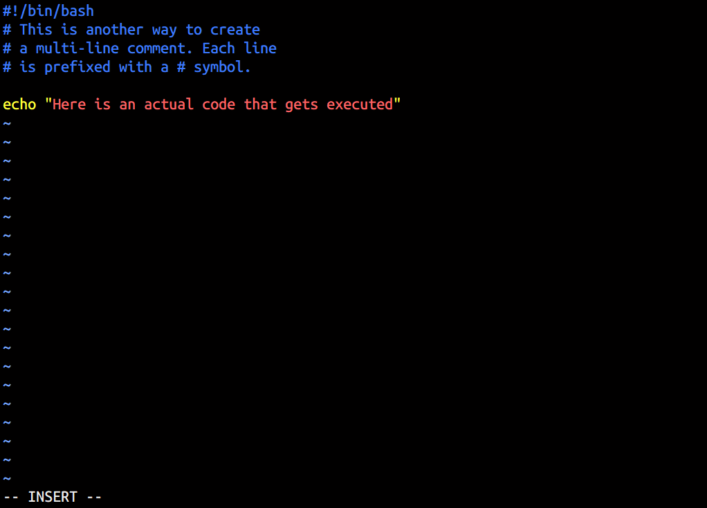
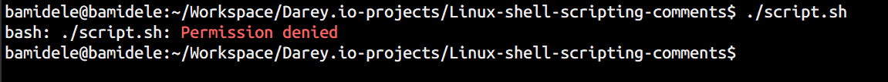
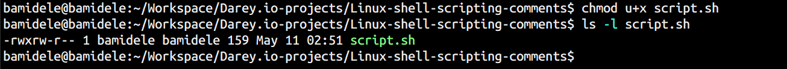
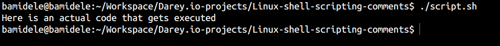

# Linux Shell Scripting - Adding Comments in Bash Scripts

Comments are an essential part of any programming language, including shell scripting. They help document the code, making it easier to understand and maintain. In shell scripts, comments are added using the `#` symbol.

## Single-Line Comments

Single-line comments start with the `#` symbol. Everything after the `#` on that line is ignored by the shell.

- Created a simple script to demonstrate single-line comments.

- Run the script, but it will fail because the script does not have execute permission.

- To run the script, you need to change its permission to make it executable. You can do this using the `chmod` command.

- After changing the permission, you can run the script again. This time it will execute successfully.

## Multi Single-Line Comments

Bash does not have a built-in multi-line comment syntax like some other programming languages. However, you can use a combination of single-line comments or a here-document to achieve a similar effect.

- Created a simple script to demonstrate multi single-line comments.

- Run the script, but it will fail because the script does not have execute permission.

- To run the script, you need to change its permission to make it executable. You can do this using the `chmod` command.

- After changing the permission, you can run the script again. This time it will execute successfully.

