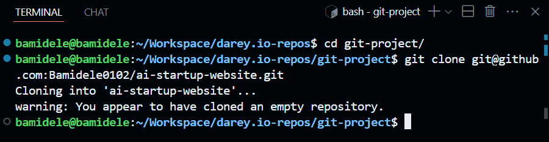
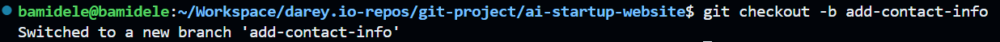

# Collaborative Website Development with Git and GitHub

In this mini project, we'll create a step-by-step project to simulate the
workflow of Tom and Jerry using Git and GitHub. This hands-on project
will include installation of Git, setting up a GitHub repository, cloning the
repository, creating branches, making changes, and merging those
changes back into the main branch.

## Part 1: Setup and Initial Configuration

### Step 1: Install Git

- **Windows**: Download the Git installer from [git-scm.com](https://git-scm.com/download/win) and run it.

- Git was installed successfully and confirmed by running `git version` in the terminal.

### Step 2: Create a Git Repository

A Github repository was created with the name ai-startup-website

### Step 3: Clone the Repository

- In the terminal, I created a directory named `git project`. I navigated into it, and then cloned the repository into the directory.

- I navigate into the cloned repository.

- I created an index.html file in the cloned repository.

- I added content to the index.html file.

- I checked the changes made has not been staged for commit.

- I added the changes to the staging area.
  

- I checked the status again to confirm the changes have been staged.

- I committed the changes with a message.

- Then I pushed the main branch to GitHub.

## Part 2: Simulating Tom and Jerry's Work

### Tom's work

- I checked the branch I am currently working on.

- I created a new branch for Tom's work.

- I checked the branch again to confirm I am on the Tom's branch.

- I edited the index.html file to add Tom's content.

- I checked the status to confirm the changes have not been staged.

- I added the changes to the staging area.

- I checked the status again to confirm the changes have been staged.

- I committed the changes with a message.

- I pushed the Tom's branch to GitHub.

### Jerry's work

- I switched back to the main branch.

- I pulled the latest changes from the remote repository to ensure I have the latest version of the main branch.

- I created a new branch for Jerry's work.

- I staged Jerry's changes to the index.html file and commited them with a message.

- I pushed Jerry's branch to GitHub.

