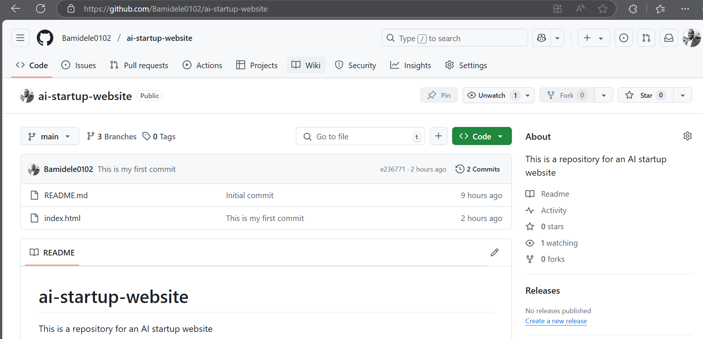
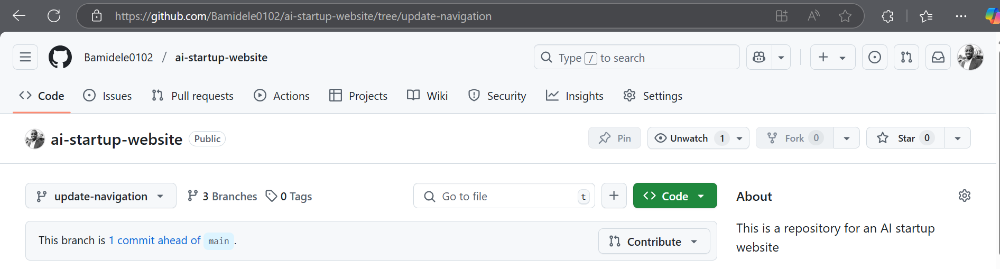
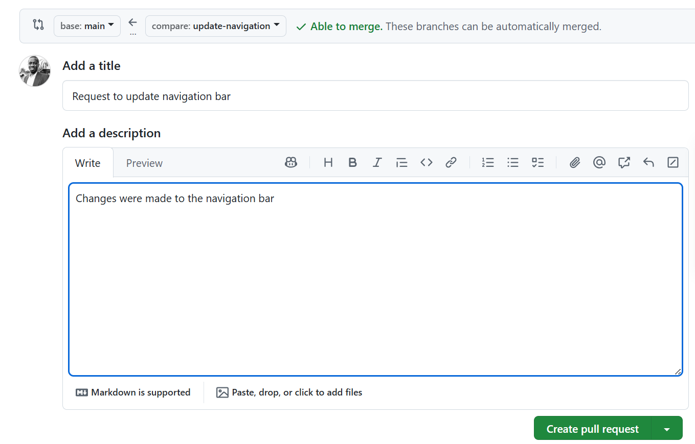
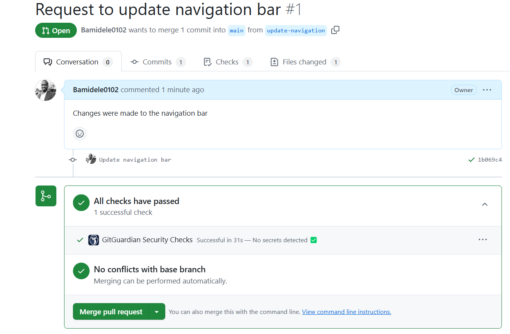
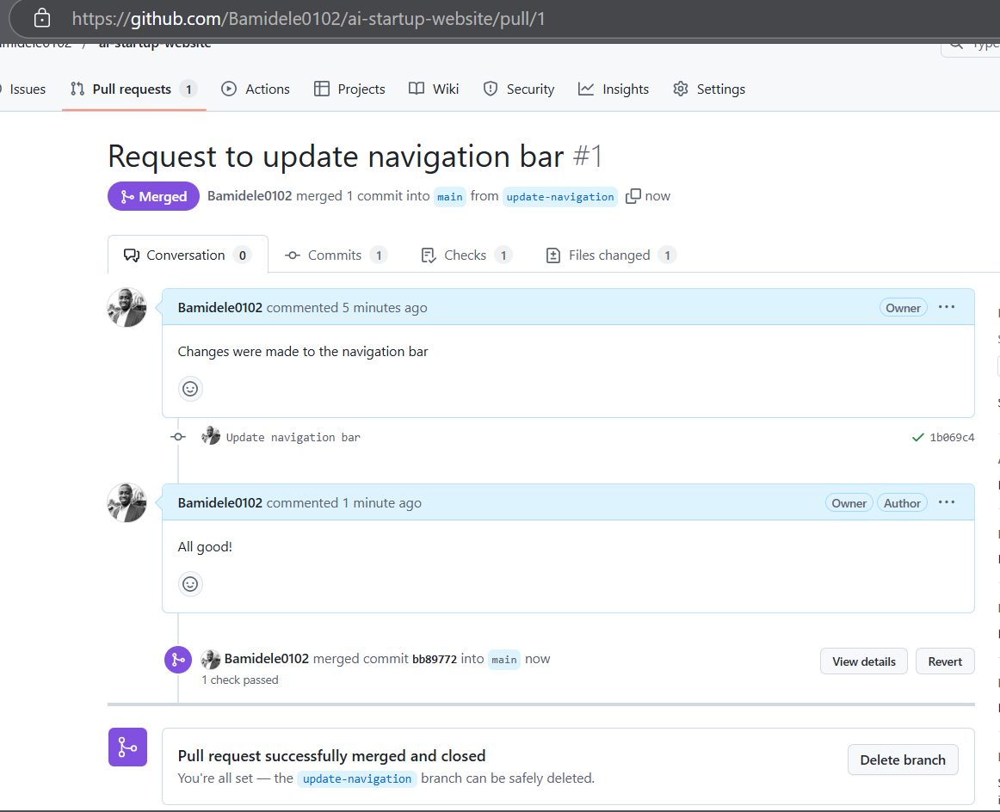
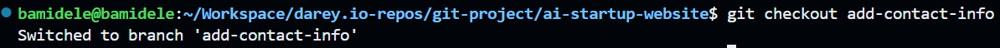
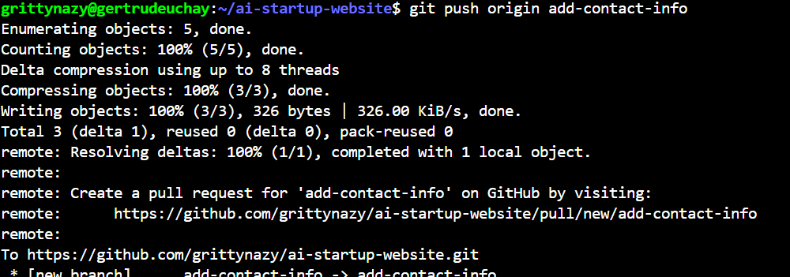

# Git Branching and Merging

## This project focuses on creating Pull Requests (PRs) and merging branches in Git

### Navigating to the GitHub repository

### Switch to the branch

### Create a Pull Request

### Merge the Pull Request

## Updating Jerry's Branch with Latest changes

- On the terminal, I switched to Jerry's branch.

- I pulled the latest changes from the main branch.

- I pushed the changes to GitHub.

